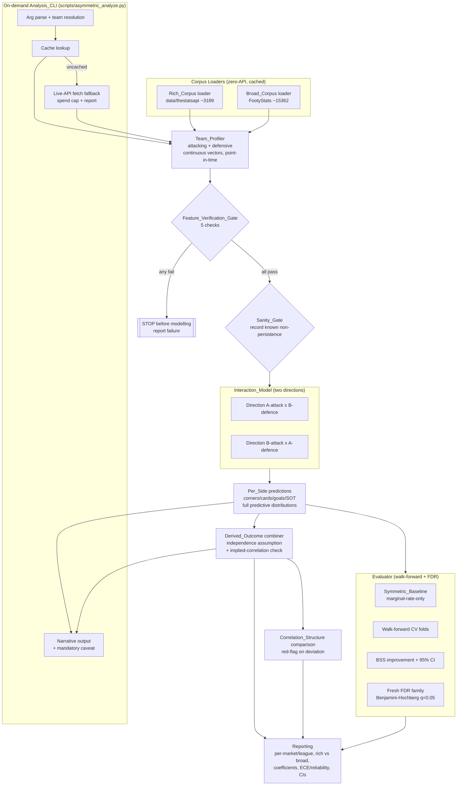

# Design Document: Asymmetric Matchup Engine

## Overview

The Asymmetric Matchup Engine treats a football fixture as an asymmetric interaction between two continuous team profiles rather than as a single aggregate total. For a fixture it builds, per side, an expectation of what each team is expected to *produce* and to *concede* across corners, cards, goals, and shots on target (SOT), with the driving mechanism made visible and interpretable. Match-level outcomes (total corners, total cards, total goals, both-teams-to-score, clean sheet per side) are *derived* from the per-side predictions rather than modelled directly.

The Engine lives inside the existing Python football quant engine at `/home/ubuntu` and reuses `src/features/` (the look-ahead-free chronological calculator pattern) and `src/research/` (the `ProbabilityModel` ABC, count-regression MLE machinery, walk-forward folds, FDR family builder, and calibration evaluator). It adds a new namespaced package `src/research/asymmetric/` and a single CLI at `scripts/asymmetric_analyze.py`. It is deliberately isolated from Prior_Efforts (Pilot C, Pipeline A, manual work, flagged ledgers): it constructs a **fresh** FDR family and inherits none of their feature selections, families, or results (Req 13).

### Design goals mapped to requirements

- Continuous, identity-free, point-in-time team profiles built from a rolling-10 / expanding-fallback window keyed on team identity (Req 1, 11).
- Two directional interaction models per fixture producing *full predictive distributions*, never collapsed to a symmetric feature (Req 2).
- Respect the empirically measured near-zero cross-market correlation structure and red-flag material deviation (Req 3).
- Dual-corpus run (Rich vs Broad) with reduced-profile variant and comparison reporting (Req 4).
- Poisson/NB count models with mandatory `n/(n+k)` team-level shrinkage on profile estimates and elastic-net regularization; logistic for binary derived outcomes; empirical dispersion check (Req 5).
- A five-check Feature_Verification_Gate that runs and reports before any modelling and *stops* on failure (Req 6).
- A Sanity_Gate recording known structural non-persistence results without re-diagnosis (Req 7).
- A decisive asymmetry-vs-marginal test: out-of-sample walk-forward BSS improvement with 95% CI lower bound > 0, within-league significance at alpha 0.05, pooled-only artifacts labelled, fresh FDR family with Benjamini-Hochberg at q=0.05, insufficient-sample exclusion (Req 8).
- An on-demand fixture CLI producing a matchup narrative backed by numbers, with cache-then-live-fetch, spend cap, a distinct EV layer, and a mandatory caveat on every output (Req 9, 12).
- Complete honest reporting with calibration, readable coefficients, and CIs everywhere; CI-spanning-zero is not a result (Req 10).
- Strict point-in-time discipline and zero-API-during-backtest as enforced non-functional invariants (Req 11, 12).
- Reproducibility and isolation from prior efforts; commit-and-push with config-change flagging (Req 13, 14).

### Key design decisions and rationale

1. **Reuse the count-regression MLE machinery, replace the team-identity effect layer.** `src/research/models/count_regression.py` already implements Poisson/NB MLE via `scipy.optimize.minimize`, an L2 penalty inside the neg-log-likelihood, `DistributionType.AUTO` dispersion selection, and an `n/(n+k)` shrinkage (`count/(count+10.0)`) toward a global mean. That shrinkage currently shrinks **team-identity effects**, which Req 1.3 forbids as model features. The new `DirectionalCountModel` reuses the MLE inner loop and dispersion selection but **removes the team-identity effect layer** and instead applies `n/(n+k)` shrinkage to the **per-team profile-feature estimates** that feed the linear predictor. Team identity is used only to *aggregate* a team's own history into profile vectors, never encoded as a model feature.

2. **Elastic-net without a new runtime dependency.** No scikit-learn is present. Rather than add it, the Engine extends the existing scipy MLE neg-log-likelihood with an elastic-net penalty term `lambda * (alpha_mix * ||w||_1 + (1 - alpha_mix) * ||w||_2^2)`, replacing the current `0.01 * sum(w^2)` L2-only term. This satisfies Req 5.4/5.5 (elastic-net preferred over pure L1) with zero new runtime deps and keeps the model auditable (readable coefficients per Req 10.3). The L1 sub-gradient at `w=0` is handled with a smoothed absolute value `sqrt(w^2 + eps)` so the L-BFGS-B optimiser remains stable. **Decision recorded; the alternative (adding scikit-learn) is rejected** to preserve the lean dependency set and the existing MLE code path.

3. **Derive-don't-model.** Following the existing `BTTSModel`/`CleanSheetModel` pattern in `derived_goals.py`, all Derived_Outcomes combine the two directions' predictive distributions under an explicitly stated independence assumption (Req 2.9, 2.10, 3.1).

4. **Hypothesis, not helper: two directions are two estimators.** Each direction is a distinct fitted model. Collapsing them into a single symmetric feature is structurally impossible because the two models never share a parameter vector; a property test enforces this (Req 2.3).

5. **`hypothesis` as the property-based-testing library.** Added as a new **dev** dependency only (Req 5, 6, 11 verification). It does not affect the runtime dependency set or backtest determinism.

---

## Architecture

### Component diagram



The build/backtest path (Loaders → Team_Profiler → gates → Interaction_Model → evaluator → reporting) is **strictly zero-API** (Req 12.1, 12.2). The Analysis_CLI path is the *only* place live API requests may occur, and only when required fixture/team data is absent from cache, subject to the spend cap (Req 9.16, 12.3, 12.4).

### Package layout (new vs existing)

```
src/research/asymmetric/          # NEW — namespaced, isolated from prior efforts
    __init__.py
    profiles.py                   # TeamProfiler, AttackingProfile, DefensiveProfile
    profile_dimensions.py         # named feature dimensions + reduced-profile map
    interaction.py                # DirectionalCountModel, InteractionModel
    directional_model.py          # elastic-net Poisson/NB MLE (extends count_regression)
    derived.py                    # DerivedOutcomeCombiner (BTTS, totals, clean sheet)
    correlation.py                # Correlation_Structure constants + comparison
    gates.py                      # FeatureVerificationGate, SanityGate
    evaluation.py                 # SymmetricBaseline, AsymmetryEvaluator (BSS + CI)
    fdr_family.py                 # fresh family construction wrapper
    reporting.py                  # report assembly
    corpus.py                     # RichCorpusLoader, BroadCorpusLoader (cached)
    resolution.py                 # team-name resolution, fixture lookup
    live_fetch.py                 # capped live-fetch with spend accounting
    models.py                     # pydantic data models (profiles, predictions, results)
scripts/asymmetric_analyze.py     # NEW — the on-demand CLI
tests/asymmetric/                 # NEW — unit + property tests
```

### Reused vs New Components

| Concern | Reused (existing) | New (this engine) | Requirement |
|---|---|---|---|
| Look-ahead-free chronological rolling | `src/features/rolling_form.py`, `assembler.py` "compute-before-update" pattern | `TeamProfiler` applies the same pattern for profile vectors | 1.4, 11 |
| Referee expanding-window rate + league fallback | `src/features/referee_volatility.py` (expanding, look-ahead-free, league fallback) | `RefereeCardRate` adapted for card-rate conditioning | 2.7, 2.11 |
| Count model (Poisson/NB MLE, dispersion AUTO, shrinkage) | `src/research/models/count_regression.py` MLE inner loop + `_select_distribution` | `DirectionalCountModel`: elastic-net penalty, profile-feature shrinkage, **no team-identity effects** | 5.1, 5.3, 5.5, 5.6 |
| Probability interface / distributions | `ProbabilityModel` ABC, `ProbabilityEstimate`, `PoissonModel.predict_distribution` | Per-side full predictive distribution wrappers | 2.4–2.7 |
| Derive-don't-model | `derived_goals.py` (`BTTSModel`, `CleanSheetModel`) | `DerivedOutcomeCombiner` combining two directions | 2.9, 2.10 |
| Logistic model for binary | `LogisticRegressionModel` in `probability.py` | Used for binary Derived_Outcomes | 5.2 |
| Model selection | `models/factory.py` `create_model_for_market` | Extended with asymmetric per-side entries | 2, 5 |
| Walk-forward folds / config | `walkforward/folds.py`, `config.py`, `orchestrator.py`, `result.py` | `AsymmetryEvaluator` drives folds per target×direction×league | 8.2, 11.2 |
| FDR family + BH correction | `fdr/family.py` `ResearchFamilyBuilder`, `fdr/adapter.py` `FDRAdapter` (BH) | `build_asymmetric_family` (fresh, never inherited) | 8.8–8.10, 13.3 |
| Calibration (Brier, log-loss, ECE, reliability) | `research/calibration.py` `CalibrationEvaluator`, `compare_models` | Used for ECE/reliability/Brier reporting | 5.7, 10.4, 10.5 |
| Corpus loading | `research/data_source.py` `ResearchMatch`, `research/footystats/` | `RichCorpusLoader`, `BroadCorpusLoader` | 4.1, 4.2 |
| Live client (capped) | `research/footystats/client.py`, `scripts/thestatsapi_client.py` | `CappedLiveFetcher` with spend accounting | 9.16, 12.3, 12.4 |
| EV layer (per-side) | `src/research/ev_calculator.py` | `EV_Layer` sources bet365 per-side prices (Championship + EPL) and betmgm-uk per-side prices (EPL), presented unblended per book; team cards has no per-side price | 9.9–9.11, 15 |

---

## Components and Interfaces

### Team_Profiler (`profiles.py`, `profile_dimensions.py`)

Builds, per team, exactly one `AttackingProfile` and one `DefensiveProfile` as continuous feature vectors (Req 1.1, 1.2). It reuses the "compute-before-update" chronological discipline from `RollingFormCalculator`: for each match, the profile is read from the team's accumulated history *before* that match is folded in, guaranteeing point-in-time correctness (Req 1.4, 11.3).

```python
class TeamProfiler:
    def __init__(self, window: int = 10, min_history: int = 5,
                 reduced: bool = False) -> None: ...

    def compute_profiles_map(
        self, matches: list[ResearchMatch]
    ) -> dict[int, TeamMatchProfiles]:
        """For each match_id, return the point-in-time AttackingProfile and
        DefensiveProfile for BOTH the home and away team, computed only from
        each team's matches strictly before this match (all leagues,
        keyed on team identity)."""

    def profile_for_team_at(
        self, team: str, as_of_unix: int, history: list[ResearchMatch]
    ) -> TeamMatchProfiles:
        """Point-in-time profile for a single team as of a timestamp (CLI path)."""
```

Mechanics:

- **Window and fallback.** Uses a per-team `deque(maxlen=10)` of recent completed matches; when fewer than 10 are available, all available (expanding) are used (Req 1.4). This mirrors `deque(maxlen=window)` in `RollingFormCalculator`.
- **Identity keying, not slot.** A team's own matches are aggregated across both home and away appearances (Req 1.5, 1.18, 11.4). "Produced" and "conceded" quantities are read from the correct side of each historical match depending on whether the team was home or away — never from the fixture slot of the target match.
- **No identity as feature.** The team string is used only as a dictionary key for aggregation; it never appears in the feature vector (Req 1.3).
- **Min-history flag.** Teams with `< 5` completed matches have both profiles marked `insufficient=True` (Req 1.16), which downstream gates the CLI reduced-coverage path (Req 9.7) and full-profile modelling.
- **Missing-field exclusion.** If a raw field for a feature is unavailable (`None` per the normalizer's NULL≠ZERO rule) for a historical match, that match is excluded from *that feature only*; the feature is computed from remaining matches, and the excluded fields are recorded in `missing_fields` (Req 1.17).
- **All-leagues aggregation.** History is not filtered by league (Req 1.18).

**Named attacking dimensions** (Req 1.6–1.10). Each is a scalar computed as a window mean of a per-match raw ratio/rate, look-ahead-free:

| Dimension | Derived from (raw fields) | Requirement |
|---|---|---|
| `width` | accurate crosses, wide entries, corners won (per match) | 1.6 |
| `central_penetration` | touches in penalty area, final-third entries, shots inside box (touches in penalty area is Championship-thin ~5%, so this dimension is flagged reduced-confidence for the Championship — audit, Req 17.3) | 1.7 |
| `volume_vs_quality` | total shots, shots on target, big chances, npxG per shot | 1.8 |
| `set_piece_reliance` | corners won, fouls won in advanced areas | 1.9 |
| `directness` | attacks vs dangerous-attacks ratio, long balls | 1.10 |

**Named defensive dimensions** (Req 1.11–1.15):

| Dimension | Derived from (raw fields) | Requirement |
|---|---|---|
| `block_orientation` | clearances, interceptions, tackles | 1.11 |
| `aerial_vs_ground` | aerial duel %, ground duel % | 1.12 |
| `shot_suppression` | shots conceded inside box, outside box, blocked shots | 1.13 |
| `gk_contribution` | saves, high claims where present (goals prevented vs expected is unavailable — the audit found it zero-populated across Rich_Corpus leagues, so the feature is built from saves/high_claims only and records goals_prevented as unavailable — Req 17.1, 17.2) | 1.14 |
| `discipline` | fouls conceded, tackle success, cards | 1.15 |

**Reduced-profile variant** for the Broad_Corpus (Req 4.3): only fields present in FootyStats core are used — `width` derived from corners, `directness` from the attacks-vs-dangerous-attacks ratio, `discipline` from fouls and cards. Dimensions that require rich-only fields are marked absent. The reduced flag is carried on the profile so reporting can compare rich vs broad (Req 4.5).

### Interaction_Model (`interaction.py`, `directional_model.py`)

Models each fixture as exactly two Directions (Req 2.1, 2.2) and never collapses them (Req 2.3).

```python
class InteractionModel:
    def fit(self, dataset: list[DirectionObservation]) -> None: ...
    def predict_fixture(self, fixture_ctx: FixtureContext) -> FixturePrediction: ...

class DirectionalCountModel(ProbabilityModel):
    """One direction, one Per_Side_Target. Poisson/NB with elastic-net + profile
    shrinkage. Produces a FULL predictive distribution."""
    def fit(self, features: list[dict[str, float]], outcomes: list[bool]) -> None: ...
    def predict_distribution(self, features: dict[str, float], max_k: int) -> list[float]: ...
    def predict_expected_count(self, features: dict[str, float]) -> float: ...
```

**Linear predictor construction (asymmetry made explicit).** For a Direction "X-attack against Y-defence", the linear predictor for a count target is:

```
log(lambda) = intercept
            + w_att . attack_profile(X)      # attacker's attacking dimensions
            + w_def . defence_profile(Y)      # defender's defensive dimensions
            + w_int . interaction_terms(X_att, Y_def)   # named cross terms
            + card_conditioning (cards target only)
```

The attacker vector and defender vector enter **from different teams**. Swapping to the other direction uses `attack_profile(Y)` against `defence_profile(X)` — a different input vector fed to a *separately fitted* estimator. There is no symmetric summary such as `(X+Y)/2`; the two directions cannot be reconstructed from a single symmetric feature (Req 2.3, enforced by Property 1). Each Per_Side_Target's prediction is derived from **named driving features** evaluated against the opponent's profile dimensions, and those names are surfaced in reporting and the CLI (Req 2.8, 9.3).

**Full predictive distributions.** Every Per_Side_Target (corners, goals, SOT, cards) returns a full `predict_distribution` (PMF over counts) via the Poisson/NB PMF, not a point estimate (Req 2.4–2.7). This reuses the `PoissonModel.predict_distribution` idea and the NB PMF path already present in `count_regression.py`.

**Cards conditioning (Req 2.7, 2.11).** The cards target's linear predictor adds a term for the referee's expanding-window card rate. `RefereeCardRate` reuses the exact expanding, look-ahead-free, league-fallback pattern of `RefereeVolatilityCalculator`: for each match it reads the referee's prior card rate before folding in the current match; when the referee has insufficient prior matches or the assignment is missing, it substitutes the **league-level expanding card rate** and sets a `referee_substituted=True` flag that is surfaced (Req 2.11).

### DirectionalCountModel — model layer (`directional_model.py`)

Extends the reused MLE from `count_regression.py`:

- **Distribution & dispersion.** Reuse `_select_distribution` (`DistributionType.AUTO`) — NB when `var/mean > threshold`, else Poisson; report the empirical dispersion ratio (Req 5.1, 5.3).
- **Elastic-net penalty.** Replace `0.01 * sum(w^2)` with `lambda * (alpha_mix * sum(sqrt(w^2 + eps)) + (1 - alpha_mix) * sum(w^2))` inside `neg_ll`. Defaults `lambda=0.05`, `alpha_mix=0.5` (elastic-net; `alpha_mix < 1` guarantees it is not pure L1, Req 5.5). Coefficients remain directly readable for reporting (Req 10.3).
- **Profile-feature shrinkage.** For each per-team profile feature estimate, apply `n/(n+k)` shrinkage toward the global (all-team) mean of that dimension, `k=10.0` (matching the existing `count/(count+10.0)`), where `n` is the team's completed-match count. This is applied to the **profile inputs**, not to team-identity effects (Req 5.6, Property 3 monotonicity).
- **Binary derived outcomes** use `LogisticRegressionModel` (Req 5.2).
- **Tail calibration** reported by binning predicted tail probabilities (e.g. P(count > high line)) against realised outcomes via `CalibrationEvaluator` (Req 5.7, 10.4).

### Derived_Outcome combiner (`derived.py`, `correlation.py`)

Combines the two directions' predictive distributions to produce match-level outcomes (Req 2.9), never modelling them directly (Req 2.10). Mirrors the `derived_goals.py` derivation approach.

- **Independence assumption (stated).** Total corners/cards/goals distributions are the **discrete convolution** of the two per-side count distributions under the stated assumption that the two sides' counts are conditionally independent given profiles; BTTS = `P(sideA goals >= 1) * P(sideB goals >= 1)` under the same assumption; clean sheet per side = `P(opponent goals = 0)` (Req 3.1). The assumption text is emitted alongside every derived outcome.
- **Implied vs measured correlation.** After combining, the Engine computes the correlation *implied* by the per-side model (via the joint distribution over paired targets, e.g. cards×corners) and compares it to `Correlation_Structure` (Req 3.2). Constants (Broad_Corpus): `cards×corners = -0.033`, `cards×goals = -0.030`, `corners×goals = -0.028`, 95% CI ≈ `±0.016`.
- **Red flag.** If the implied correlation lies outside the measured value ± its CI by a material margin (configurable, default: outside `measured ± max(CI, 0.05)`), the deviation is reported as a red flag (Req 3.3). Measured values and CIs are always reported alongside the comparison (Req 3.4).

### Feature_Verification_Gate (`gates.py`)

Runs before any modelling and reports every check; on any failure it **stops before modelling** and reports the failure (Req 6.1, 6.7, 6.8). Returns a `GateResult` with per-check pass/fail and detail.

1. **Team-identity trace** (Req 6.2): for 3–5 sampled teams, print the exact list of historical matches (with home/away role) that a rolling feature aggregated, confirming it is that team's matches across home and away appearances. Fails if any traced feature pulled another team's match.
2. **Known-signal** (Req 6.3): confirm the rolling-xG-to-goals association is `>= ~0.10` (not `~0.00`) and rolling-goals-to-goals is positive. Uses Spearman/Pearson on point-in-time features vs realised outcomes.
3. **Orientation** (Req 6.4): confirm `team_a` features align with `team_a` outcomes and verify against source data (a direct row-level cross-check that the "home" profile maps to the home outcome column).
4. **Look-ahead** (Req 6.5): confirm no feature for match M uses M or any later match. Implemented by recomputing a sampled feature from a truncated history (matches strictly before M) and asserting equality with the pipeline value — this is also enforced as Property 2.
5. **Shuffle-null** (Req 6.6): permute the feature-to-outcome mapping and confirm performance collapses to chance (BSS ≈ 0). Fails if shuffled performance retains skill (indicates leakage).

### Sanity_Gate (`gates.py`)

Runs per league and per target before searching (Req 7.1). It **records** (does not re-diagnose) the known structural results (Req 7.4):

- Corners have near-zero team-level persistence at rolling-window timescales (Req 7.2).
- Cards disciplinary persistence is absent in the Championship across three seasons (Req 7.3).

These are stored as `SanityRecord` entries and surfaced in reporting; the search skips re-diagnosis for these known non-signals.

### Asymmetry-vs-Marginal evaluator (`evaluation.py`, `fdr_family.py`)

```python
class SymmetricBaseline(ProbabilityModel):
    """Same modelling family (Poisson/NB) using ONLY the team's own marginal
    rate for the target — no interaction layer."""

class AsymmetryEvaluator:
    def evaluate(self, targets, directions, leagues, corpus) -> AsymmetryReport: ...
```

- **Comparison.** For each Per_Side_Target, compare `InteractionModel` against `SymmetricBaseline` (Req 8.1). Interaction performance is never reported in isolation (Req 8.5).
- **Out-of-sample.** Evaluate via walk-forward CV folds from `FoldGenerator`; no fixture used to fit a model contributes to that model's score (Req 8.2, 11.2).
- **Beat criterion.** The asymmetry hypothesis passes for a target only if out-of-sample BSS improvement over baseline is strictly positive with a 95% CI lower bound > 0; otherwise report failure for that target (Req 8.3). CIs computed by bootstrap over fold/test observations.
- **Within-league significance.** Require within-league BSS improvement significant at alpha 0.05 for any finding (Req 8.6). A result significant only when leagues are pooled and not within its own league is reported as an **artifact**, not a finding (Req 8.7).
- **Per market and per league** reporting (Req 8.4).
- **Fresh FDR family.** Build via `ResearchFamilyBuilder.build(...)` with `hypothesis_count` = count of every target×direction×league model tested; correct within-league significance with Benjamini-Hochberg at q=0.05 through the existing `FDRAdapter` (Req 8.8, 8.9). The family is fresh and never inherited (Req 8.10, 13.3), keyed on a new `research_run_id` and this engine's dataset version.
- **Insufficient sample.** If a league has fewer matches than the minimum required to compute a within-league test for a target, exclude that league-target from any finding and report it as `insufficient-sample` (not a finding or artifact) (Req 8.11).

### Analysis_CLI (`scripts/asymmetric_analyze.py`, `resolution.py`, `live_fetch.py`)

Invocation (Req 9.1): `python scripts/asymmetric_analyze.py --home "Leeds" --away "Norwich" --date 2026-09-05`.

Flow:

1. **Parse & validate** args; date must be ISO 8601 `YYYY-MM-DD`.
2. **Resolve teams** (`resolution.py`): unrecognised name → reject, identify the name, no predictions (Req 9.13); ambiguous name → reject, list candidates, no predictions (Req 9.14).
3. **Fixture lookup**: if no fixture between the teams on the date → report no matching fixture, no predictions (Req 9.15).
4. **Cache then live fetch**: if required fixture/team data is absent from cache, fetch via `CappedLiveFetcher` before predicting (Req 9.16, 12.3); enforce a spend cap and report spend incurred (Req 12.4). If the cap would be exceeded, terminate with a capped-fetch error (still carrying the caveat).
5. **Coverage handling**: zero cached history for a team → report no profile can be produced, identify the team, terminate without predictions (Req 9.8); `>=1` but `< 5` matches → flag reduced-coverage, state count vs required minimum, continue with reduced profile (Req 9.7).
6. **Narrative output** sections:
   - Profiles as **named dimensions each with its numeric value** (Req 9.2).
   - Per-side predictions for corners, cards, goals, SOT, each with **named driving features** (Req 9.3).
   - Derived totals + BTTS (Req 9.4).
   - Explicit **asymmetry statement** naming, for each of total corners/cards/goals/BTTS, which side dominates and the responsible driving feature (Req 9.5).
   - Per-team **coverage**: match count and populated-vs-absent rich fields (Req 9.6).
   - **EV as a distinct labelled section** where odds exist (Req 9.9), reusing `src/research/ev_calculator.py`. The `EV_Layer` computes per-side EV **only for `Per_Side_Priced_Markets`** (team corners, team total goals, team shots on target) and **only from `Priced_Books`**, grounded in the coverage audit (`docs/coverage_matrix.md`):
     - **Championship fixtures:** per-side prices are sourced from **bet365 only** (Req 9.10, 15.2).
     - **EPL fixtures:** per-side prices are sourced from **both bet365 and betmgm-uk**, presenting each book's implied value and EV **separately, not blended** (Req 9.10, 15.3, 15.4).
     - **Team cards** has **no per-side price in any book**: the model cards prediction is presented **without** a per-side EV comparison, stating that no per-side price is available; team-cards EV is available only via the `Derived_Outcome` total cards market where that total is priced (Req 9.11, 15.5, 15.7).
     - Per-side markets are richer in EPL than in the Championship: paddy-power/betmgm-uk price per-side in EPL but not in the sampled Championship fixtures, while bet365 carries per-side in both. See `docs/coverage_matrix.md` for the authoritative book×market×league coverage (Req 15.1, 15.6).
7. **Mandatory caveat** on *every* output, including reduced-coverage and error outputs: a single fixture demonstrates nothing about edge and the Engine has not beaten market prices in systematic testing (Req 9.12).

### Audit-Grounded Constraints

These constraints record limitations established by the coverage audit (`docs/coverage_matrix.md`) that shape the profiling and prediction paths.

- **Referee availability (Req 16).** Referee assignment is **not available pre-match** in either data source: TheStatsAPI fixtures carry no referee field, and FootyStats `refereeID` is null until post-match. Therefore the cards `Per_Side_Target` uses the **league-level expanding-window card rate as the PRIMARY pre-match path**. A referee-specific expanding card rate is used **only in backtest** on completed fixtures with a known post-match referee id (Req 16.2). The `Analysis_CLI` **never** conditions a pre-match cards prediction on a referee-specific rate (Req 16.3); where the league-level rate is substituted for a referee-specific rate, the substitution is flagged (Req 16.1, 16.4). This refines the cards-conditioning mechanics of the Interaction_Model (Req 2.7, 2.11) rather than replacing them.
- **Goalkeeper dimension (Req 17).** `goals_prevented` is **zero-populated across all Rich_Corpus leagues**, so the `gk_contribution` dimension of the Defensive_Profile is built from **saves** (and **high_claims** where present), **not** `goals_prevented`; the Team_Profiler records `goals_prevented` as unavailable via the dimension's `missing_fields` (Req 17.1, 17.2). `touches_in_penalty_area` is **thin in the Championship (~5%)**, so `central_penetration` is flagged **reduced-confidence** for the Championship (Req 17.3).

### Reporting (`reporting.py`)

Assembles (Req 10):

- Headline per-side vs baseline per market and per league (10.1).
- Rich vs Broad comparison (10.2, 4.4, 4.5).
- Readable elastic-net coefficients per dimension (10.3).
- ECE and reliability curves per target (10.4) via `CalibrationEvaluator`.
- Out-of-sample BSS vs naive baseline, Brier, ECE (10.5).
- All results including failures, no post-hoc selection (10.6).
- Fresh FDR family size (10.7, 8.9).
- A CI for every reported estimate (10.8); any estimate whose CI spans zero is labelled **"not a result"** (10.9, Property 6).

---

## Data Models

Pydantic v2 models (matching the codebase's `pydantic==2.6.1`) for structured outputs; frozen dataclasses where they mirror existing research types (e.g. profiles that feed numeric pipelines). Where a model participates in the `ProbabilityModel` pipeline it uses plain `dict[str, float]` features for compatibility with existing `fit`/`predict` signatures.

```python
from pydantic import BaseModel, Field, ConfigDict

class ProfileDimension(BaseModel):
    model_config = ConfigDict(frozen=True)
    name: str
    value: float
    source_fields: tuple[str, ...]          # raw fields it was derived from
    n_matches_used: int                     # matches contributing (post exclusion)
    missing_fields: tuple[str, ...] = ()     # fields unavailable (Req 1.17)

class AttackingProfile(BaseModel):
    model_config = ConfigDict(frozen=True)
    team: str                               # aggregation key only, never a feature
    as_of_unix: int
    width: ProfileDimension
    central_penetration: ProfileDimension
    volume_vs_quality: ProfileDimension
    set_piece_reliance: ProfileDimension
    directness: ProfileDimension
    reduced: bool = False                   # Broad_Corpus reduced variant
    def vector(self) -> list[float]: ...    # continuous feature vector (Req 1.2)

class DefensiveProfile(BaseModel):
    model_config = ConfigDict(frozen=True)
    team: str
    as_of_unix: int
    block_orientation: ProfileDimension
    aerial_vs_ground: ProfileDimension
    shot_suppression: ProfileDimension
    gk_contribution: ProfileDimension
    discipline: ProfileDimension
    reduced: bool = False
    def vector(self) -> list[float]: ...

class TeamMatchProfiles(BaseModel):
    model_config = ConfigDict(frozen=True)
    team: str
    n_history: int
    insufficient: bool                      # < 5 matches (Req 1.16)
    attacking: AttackingProfile
    defensive: DefensiveProfile

class DirectionPrediction(BaseModel):
    model_config = ConfigDict(frozen=True)
    direction: str                          # "A_attack_vs_B_defence" | "B_attack_vs_A_defence"
    attacker: str
    defender: str
    target: str                             # "corners" | "cards" | "goals" | "sot"
    distribution: tuple[float, ...]         # full PMF (Req 2.4-2.7)
    expected_value: float
    driving_features: tuple[str, ...]       # named drivers (Req 2.8, 9.3)
    referee_substituted: bool = False       # cards fallback used (Req 2.11)

class FixturePrediction(BaseModel):
    model_config = ConfigDict(frozen=True)
    home_team: str
    away_team: str
    date_unix: int
    directions: tuple[DirectionPrediction, ...]   # exactly two per target
    derived: "DerivedOutcomes"
    independence_assumption: str            # stated (Req 3.1)

class DerivedOutcomes(BaseModel):
    model_config = ConfigDict(frozen=True)
    total_corners: tuple[float, ...]        # convolution PMF
    total_cards: tuple[float, ...]
    total_goals: tuple[float, ...]
    btts_yes: float
    clean_sheet_home: float
    clean_sheet_away: float
    implied_correlations: dict[str, float]  # e.g. {"cards_corners": -0.03}
    measured_correlations: dict[str, tuple[float, float]]  # value, ci_halfwidth
    correlation_red_flags: tuple[str, ...]  # Req 3.3

class GateCheckResult(BaseModel):
    model_config = ConfigDict(frozen=True)
    name: str
    passed: bool
    detail: str
    metric: float | None = None

class GateResult(BaseModel):
    model_config = ConfigDict(frozen=True)
    gate: str                               # "feature_verification" | "sanity"
    passed: bool
    checks: tuple[GateCheckResult, ...]
    stopped_modelling: bool                 # Req 6.8

class Estimate(BaseModel):
    model_config = ConfigDict(frozen=True)
    point: float
    ci_low: float
    ci_high: float
    @property
    def spans_zero(self) -> bool:           # Req 10.9
        return self.ci_low <= 0.0 <= self.ci_high
    @property
    def is_result(self) -> bool:
        return not self.spans_zero

class AsymmetryComparison(BaseModel):
    model_config = ConfigDict(frozen=True)
    target: str
    direction: str
    league: str | None                      # None = pooled
    corpus: str                             # "rich" | "broad"
    bss_improvement: Estimate               # vs Symmetric_Baseline (Req 8.3)
    within_league_significant: bool
    pooled_only_artifact: bool              # Req 8.7
    insufficient_sample: bool               # Req 8.11
    fdr_passed: bool | None                 # BH q=0.05 (Req 8.9)
    verdict: str                            # "finding" | "artifact" | "fails" | "insufficient-sample"

class SpendReport(BaseModel):
    model_config = ConfigDict(frozen=True)
    requests_made: int
    spend_units: float
    cap: float
    cap_exceeded: bool                      # Req 12.4
```

The CLI's textual narrative is rendered from `FixturePrediction`, `TeamMatchProfiles`, and `SpendReport`, always appending the mandatory caveat (Req 9.10).


---

## Correctness Properties

*A property is a characteristic or behavior that should hold true across all valid executions of a system — essentially, a formal statement about what the system should do. Properties serve as the bridge between human-readable specifications and machine-verifiable correctness guarantees.*

Each property below is universally quantified and is validated by a single property-based test (see Testing Strategy). Properties were consolidated during prework to remove redundancy (e.g. the point-in-time invariance for Req 1.4, 6.5, and 11.3 is a single property).

### Property 1: Directions never collapse to a symmetric output

*For any* fixture whose two teams have differing attacking/defensive profiles, the two Directions' predictive distributions for a given target are not identical, and swapping team A with team B swaps the two Directions' outputs (rather than leaving them unchanged) — so no single symmetric feature can reproduce both Directions.

**Validates: Requirements 2.1, 2.2, 2.3**

### Property 2: Point-in-time invariance

*For any* match M and any set of matches occurring strictly after M, the Attacking_Profile and Defensive_Profile computed for M are identical whether or not those later matches are present in the corpus; equivalently, the profile for M computed from the full history equals the profile computed from history truncated to strictly before M.

**Validates: Requirements 1.4, 6.5, 11.1, 11.3**

### Property 3: Team-identity relabel-invariance and all-leagues aggregation

*For any* team history, relabelling the team identity (and only the identity, leaving all statistics and the set of the team's matches unchanged, across all leagues) produces identical profile vectors; and the number of a team's matches aggregated into its profile equals the count of that team's completed matches regardless of the leagues those matches belong to.

**Validates: Requirements 1.3, 1.5, 1.18, 11.4**

### Property 4: Valid predictive distributions

*For any* Direction and any Per_Side_Target (corners, cards, goals, SOT), the returned predictive distribution is a valid probability mass function: every entry lies in [0, 1] and the entries sum to 1 within numerical tolerance.

**Validates: Requirements 2.4, 2.5, 2.6, 2.7**

### Property 5: Referee substitution and flagging for cards

*For any* fixture, the cards Per_Side_Target uses the referee expanding-window card rate when a sufficiently-observed referee is assigned, and otherwise substitutes the league-level expanding-window card rate and sets `referee_substituted = True`; the substituted prediction equals the prediction produced by conditioning on the league rate.

**Validates: Requirements 2.7, 2.11**

### Property 6: Derived combination under independence

*For any* two per-side count distributions, the derived total distribution equals their discrete convolution and is itself a valid PMF, and the mean of the derived total equals the sum of the two per-side means; the derived BTTS probability equals `P(sideA >= 1) * P(sideB >= 1)` under the stated independence assumption.

**Validates: Requirements 2.9, 3.1**

### Property 7: Implied-vs-measured correlation red flag

*For any* pair of per-side models, the Engine reports an implied cross-market correlation and raises a red flag if and only if that implied correlation lies outside the measured Correlation_Structure value by more than the reported tolerance (measured value ± its 95% CI half-width, floored at the material threshold).

**Validates: Requirements 3.2, 3.3, 3.4**

### Property 8: Team-level shrinkage monotonicity

*For any* fixed team-mean and global-mean profile estimate, increasing the team's completed-match count n moves the shrunk estimate `n/(n+k)*team_mean + (k/(n+k))*global_mean` monotonically closer to the team mean and never further away, and the shrinkage weight `n/(n+k)` is strictly increasing in n.

**Validates: Requirements 5.1, 5.6**

### Property 9: Dispersion-driven distribution selection

*For any* set of training counts, the count model selects the negative-binomial distribution when the empirical variance-to-mean ratio exceeds the overdispersion threshold and the Poisson distribution otherwise, and reports the empirical dispersion ratio.

**Validates: Requirements 5.3**

### Property 10: Elastic-net regularization shrinks coefficients and retains correlated features

*For any* training data, fitting at an increasing regularization strength lambda produces coefficient vectors whose L2 norm is non-increasing, and for two strongly correlated informative features the elastic-net fit retains non-zero weight on both (it does not arbitrarily zero one out as pure L1 would).

**Validates: Requirements 5.4, 5.5**

### Property 11: Missing-field exclusion

*For any* team history in which a required raw field is absent for some subset of matches, each affected profile feature is computed only from the matches where the field is present and equals the feature computed over that present-field subset, and the absent field is recorded in the dimension's `missing_fields`.

**Validates: Requirements 1.17**

### Property 12: Out-of-sample fold disjointness

*For any* generated walk-forward fold, the set of fixture identifiers used to fit a model for that fold is disjoint from the set of fixture identifiers used to score it.

**Validates: Requirements 8.2, 11.2**

### Property 13: Shuffle-null collapses to chance

*For any* dataset, permuting the feature-to-outcome mapping yields an out-of-sample BSS that is within a small tolerance of zero (chance), so the shuffle-null gate check passes only when no leakage remains.

**Validates: Requirements 6.6**

### Property 14: Gate stops modelling on any failure

*For any* Feature_Verification_Gate run in which at least one check fails, the resulting `GateResult` has `passed = False` and `stopped_modelling = True`, and no downstream modelling is performed.

**Validates: Requirements 6.1, 6.7, 6.8**

### Property 15: Confidence interval on every estimate and CI-spanning-zero suppression

*For any* reported estimate, `ci_low <= point <= ci_high` holds, and the estimate is treated as a result if and only if its CI does not span zero; an estimate whose CI spans zero is labelled "not a result".

**Validates: Requirements 10.8, 10.9**

### Property 16: Asymmetry verdict decision logic

*For any* Per_Side_Target comparison, the verdict is "finding" only if the out-of-sample BSS improvement over the Symmetric_Baseline is strictly positive with a 95% CI lower bound greater than zero and the within-league improvement is significant at alpha 0.05 and it survives Benjamini-Hochberg at q=0.05; otherwise the comparison is reported as "fails".

**Validates: Requirements 8.1, 8.3, 8.5, 8.6, 8.9**

### Property 17: Pooled-only significance is an artifact

*For any* comparison that is significant at the 0.05 level only when leagues are pooled and is not significant within its own league, the verdict is "artifact" and never "finding".

**Validates: Requirements 8.7**

### Property 18: Insufficient-sample exclusion

*For any* league-target combination whose within-league sample is below the minimum required for the significance test, the verdict is "insufficient-sample", and that combination is excluded from both findings and artifacts.

**Validates: Requirements 8.11**

### Property 19: Fresh FDR family sizing

*For any* tested grid of targets, directions, and leagues, the constructed FDR_Family's `hypothesis_count` equals the number of target×direction×league models actually tested, and the family_id is a deterministic function of only this Engine's run identity, dataset version, and model family.

**Validates: Requirements 8.8, 8.10, 13.3**

### Property 20: Mandatory caveat on every output

*For any* Analysis_CLI output — success, reduced-coverage, unrecognised team, ambiguous team, no-fixture, zero-history, or cap-exceeded — the rendered output contains the mandatory caveat stating that a single fixture demonstrates nothing about edge and that the Engine has not beaten market prices in systematic testing.

**Validates: Requirements 9.10**

### Property 21: Reject-without-predictions on bad resolution

*For any* invocation whose home or away name is unrecognised, whose name is ambiguous, or for which no fixture is scheduled on the supplied date, the Analysis_CLI produces no Per_Side_Target or Derived_Outcome predictions and its output identifies the specific offending input.

**Validates: Requirements 9.11, 9.12, 9.13**

### Property 22: Live-fetch spend cap

*For any* sequence of live fetch costs, the cumulative admitted spend never exceeds the configured cap; when the next fetch would breach the cap it is refused and `cap_exceeded` is set; and the reported `spend_units` equals the sum of the admitted fetch costs.

**Validates: Requirements 12.4**

### Property 23: Zero API during build and backtest

*For any* build or backtest execution over the cached corpora, the live API client is never invoked.

**Validates: Requirements 12.1, 12.2**

### Property 24: Audit-grounded per-side EV coverage

*For any* fixture and any requested market, the `EV_Layer` computes a per-side expected value **if and only if** the market is a `Per_Side_Priced_Market` (team corners, team total goals, team shots on target) and a `Priced_Book` prices it for that league; team cards never receives a per-side EV; a Championship fixture sources per-side prices only from bet365, and an EPL fixture that is priced by both bet365 and betmgm-uk presents both books' EV separately (unblended).

**Validates: Requirements 9.9, 9.10, 9.11, 15**

---

## Error Handling

The Engine follows the codebase convention of explicit status/None handling (NULL ≠ ZERO, per the normalizer, and `PredictionResult`/`PredictionStatus` in `probability.py`) rather than fabricating values.

| Situation | Handling | Requirement |
|---|---|---|
| Team with `< 5` completed matches | Mark profile `insufficient=True`; full-profile modelling excludes it; CLI flags reduced-coverage and continues on the reduced profile | 1.16, 9.7 |
| Team with 0 cached matches (CLI) | Report no profile can be produced, identify the team, terminate without predictions (caveat still emitted) | 9.8, 9.10 |
| Missing referee assignment | Substitute league-level expanding card rate, set `referee_substituted=True`, surface the substitution | 2.11 |
| Missing raw field for a feature | Exclude the affected match from that feature, compute from remaining matches, record in `missing_fields` | 1.17 |
| Unrecognised team name (CLI) | Reject invocation, identify the unrecognised name, no predictions | 9.11 |
| Ambiguous team name (CLI) | Reject invocation, list candidate matches, no predictions | 9.12 |
| No scheduled fixture on date (CLI) | Report no matching fixture for teams+date, no predictions | 9.13 |
| Required fixture/team data uncached (CLI) | Fetch via `CappedLiveFetcher` before predicting | 9.14, 12.3 |
| Live-fetch cap would be exceeded | Refuse further fetch, set `cap_exceeded=True`, report spend, terminate with capped-fetch error (caveat emitted) | 12.4 |
| Any Feature_Verification_Gate check fails | Stop before modelling, `stopped_modelling=True`, report which check failed and its detail | 6.8 |
| Insufficient within-league sample | Label league-target `insufficient-sample`, exclude from findings and artifacts | 8.11 |
| Estimate CI spans zero | Label "not a result"; do not report as a finding | 10.9 |
| Model fit fails / not fitted | Return `PredictionResult` with `MODEL_FAILURE`/`MODEL_NOT_FITTED` (reuse existing `predict_safe`) | — |
| Degenerate distribution (all mass at 0) | PMF still valid (sums to 1); derived convolution well-defined | 2.4–2.7, 2.9 |

Zero-API discipline: build/backtest code paths accept an injected data source that only reads cache; the live fetcher is confined to the CLI package and is never imported into the build/backtest path (Req 12.1, 12.2, 13.4).

---

## Testing Strategy

The Engine uses a dual testing approach: **property-based tests** for universal correctness properties and **example-based unit/integration tests** for specific behaviours, edge cases, wiring, and reporting artifacts. Property-based testing is appropriate here because the core components are pure functions over structured inputs (profile aggregation, count distributions, convolutions, shrinkage, decision logic) with large input spaces and clear universal invariants.

### Property-based testing

- **Library:** [`hypothesis`](https://hypothesis.readthedocs.io/) for Python. Added as a **new dev dependency** (`dev` extra in `pyproject.toml`: `hypothesis==6.*`). It is not a runtime dependency and does not affect backtest determinism. Adding it to `[project.optional-dependencies].dev` is a shared-config change and MUST be flagged on commit (Req 14.2).
- **Iterations:** each property test runs a minimum of 100 generated examples (`@settings(max_examples=100)` or higher).
- **Tagging:** each property test carries a comment in the form
  `# Feature: asymmetric-matchup-engine, Property {N}: {property_text}`
  and references the design property it implements. Each correctness property (1–23) is implemented by exactly one property-based test.
- **Generators (custom `hypothesis` strategies):**
  - `match_histories`: chronologically ordered `ResearchMatch` lists with configurable field-presence, league mix, home/away roles, and per-team counts (drives Properties 2, 3, 8, 11, 12).
  - `count_pmfs`: valid probability mass functions over small count supports (drives Properties 4, 6, 7).
  - `fixture_contexts`: attacker/defender profile pairs with controllable divergence and referee presence (drives Properties 1, 5).
  - `estimates`: `(point, ci_low, ci_high)` triples spanning and not spanning zero (drives Properties 15, 16, 17, 18).
  - `fetch_cost_sequences`: sequences of non-negative fetch costs against a cap (drives Property 22).

### Unit and integration tests (`pytest`, reusing existing conventions)

- **Reuse `pytest`** with `pythonpath=["."]` and `tests/asymmetric/` layout matching the existing `tests/` structure.
- **Example tests:** gate trace print for 3–5 teams (6.2), known-signal threshold `>= ~0.10` (6.3), orientation cross-check against source (6.4), sanity records present and not re-diagnosed (7.2–7.4), derived-outcome-only production (2.10), measured correlation constants and ±0.016 CI reported (3.4), tail-calibration bins produced (5.7), reduced-profile dimension set (4.3), CLI narrative sections present on a resolved cached fixture (9.2–9.6), EV section distinct and labelled when odds exist (9.9), fresh family disjoint from prior efforts (13.3).
- **Edge-case tests:** min-history boundary at 5 (1.16), CLI coverage branches at 0 and 5 matches (9.7, 9.8).
- **Integration tests:** end-to-end walk-forward evaluation on a small cached slice verifying BSS/Brier/ECE reporting via `CalibrationEvaluator`, fresh FDR family construction and BH correction via `FDRAdapter`, and the rich-vs-broad comparison (1–3 representative examples, not property tests, since these exercise cached-data wiring rather than input-varying logic).
- **Zero-API assertion:** build/backtest tests inject an API client stub that raises on any call, asserting no invocation (Property 23 / Req 12.2).

### Calibration and reporting verification

- ECE, reliability bins, Brier, and log-loss are computed out-of-sample via the existing `CalibrationEvaluator` (which enforces out-of-sample usage) and `compare_models` for Interaction vs Symmetric_Baseline (Req 10.4, 10.5).
- Every reported estimate is wrapped in `Estimate` with a CI; tests assert CI presence and the spans-zero suppression rule (Property 15).

### Non-functional verification

- **Point-in-time:** Property 2 plus the look-ahead gate check (6.5) enforce it throughout profiling, interaction modelling, and validation.
- **Reproducibility/isolation:** deterministic family_id and content hashes (reusing existing hashing) verified; no imports from prior-effort scripts in the build path (Property 19, Req 13).
- **Version control:** each completed unit of work is committed and pushed; the `pyproject.toml` dev-dependency addition (`hypothesis`) is flagged as a shared-config change (Req 14.1, 14.2).
